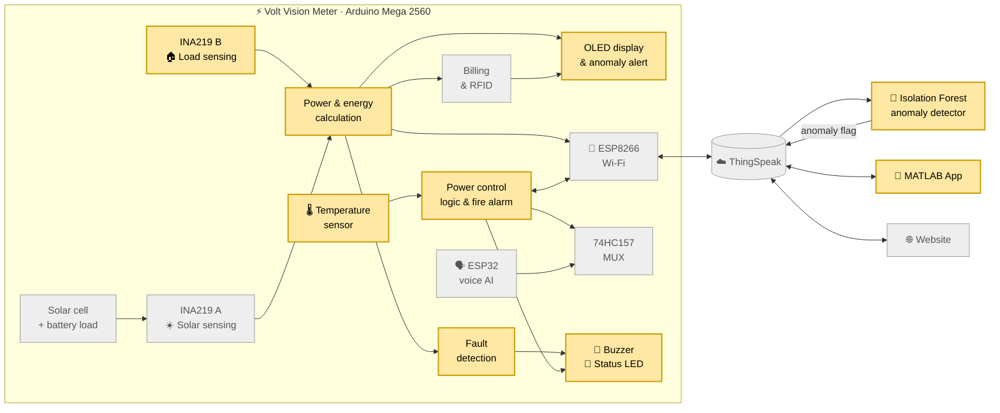
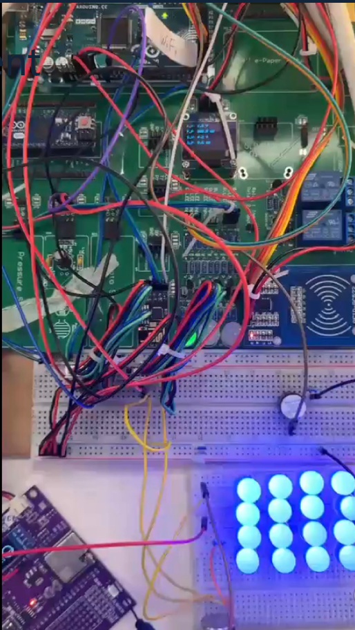
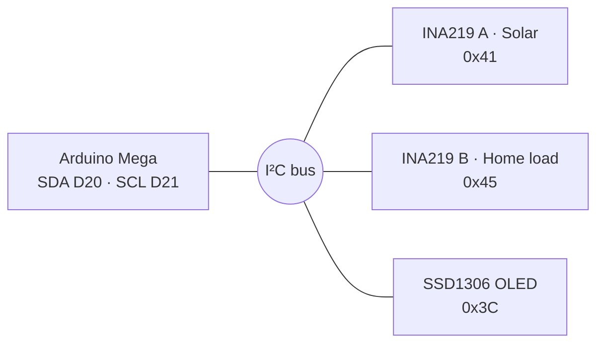
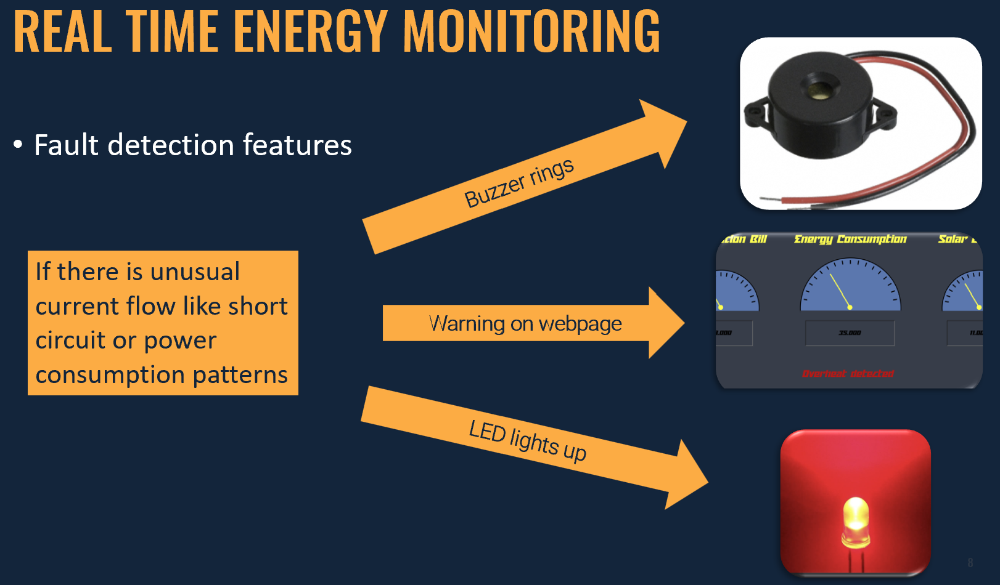
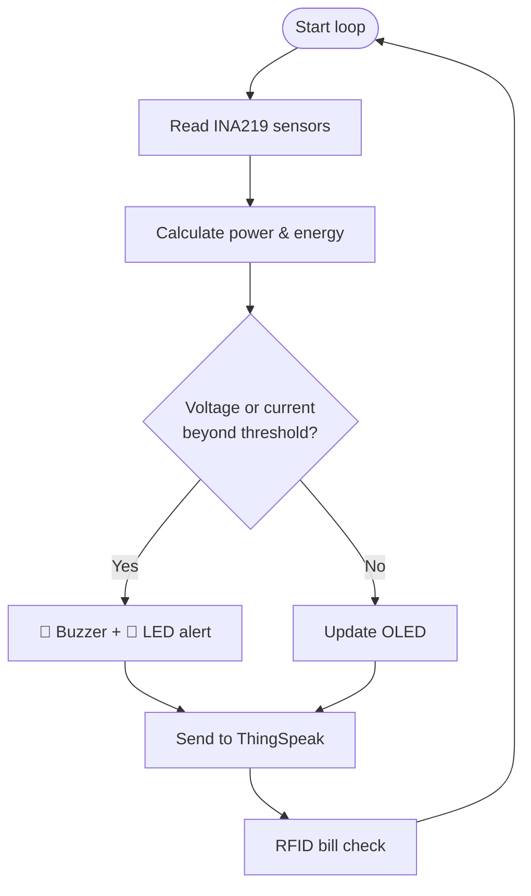
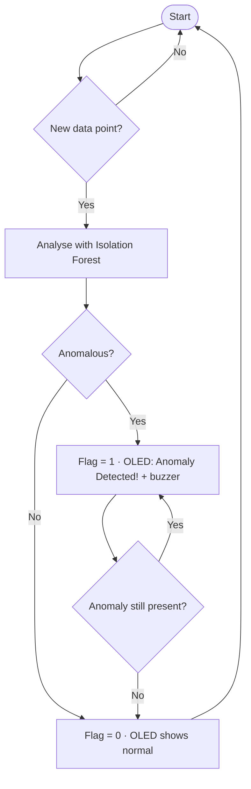

# ⚡ Volt Vision

### Sensing, intelligence and connectivity for a smart electricity meter


</div>

---

## 📖 About the Project

### The problem

Traditional electricity meters only count units. They can't tell a household what is using power right now, warn them when something goes wrong, or let them do anything about it when they're away from home.

### The solution

**Volt Vision** is a prototype smart electricity meter for homes. It measures power in real time, sends it to the cloud, protects the home automatically, and gives users several ways to see and control their electricity.

| Feature | What it does |
|:--|:--|
| 📈 **Real-time monitoring** | Measures voltage, current, power and energy for the household load and a solar panel, shown on an OLED screen |
| ☁️ **Cloud logging** | Uploads readings to ThingSpeak over Wi-Fi for remote access and history |
| 🔌 **Remote power control** | Users or the electricity company can switch the supply off from anywhere |
| 🔥 **Fire protection** | Cuts power and sounds an alarm when temperature goes above 40 °C |
| 🚨 **Fault & anomaly detection** | Threshold checks plus a machine-learning model flag unusual consumption |
| 💳 **RFID access & payment** | An authorised card reveals private bill data and pays from the card balance |
| 🗣️ **Voice assistant** | Restores power by voice and gives energy-saving advice |
| ☀️ **Solar integration** | Measures generated energy and applies a bill discount |
| 📱 **MATLAB App** | Shows meter status and sends a remote cutoff |
| 🌐 **Web dashboard** | Secure login, live gauges, custom limits and historical charts |

### The team

Volt Vision was built by four EE students, each owning a subsystem:

| Member | Subsystem |
|:--|:--|
| 🟨 **Sarker Aumio Kumar** | Sensing & intelligence: monitoring, fault detection, OLED, anomaly detection, fire alarm |
| 🟩 Ng Pui Chak Johnny | Connectivity & control: Wi-Fi, cloud, power control, solar, voice, MATLAB App |
| ⬜ Wong Xin Jerry | Billing and RFID verification and payment |
| ⬜ Wootinun Ouppapong (Boon) | Web dashboard and user database |

---

My(Aumio Kumar Sarker) work produces the data and the warnings.

---

## 🗺️ System Map

🟨 Aumio · ⬜ Teammates



---

# 🟨 Aumio Kumar Sarker's contribution

## Sensing & Intelligence

I built the firmware foundation that the whole meter runs on, then layered monitoring, fault detection and machine-learning anomaly detection on top of it.

| Subsystem | What it does |
|:--|:--|
| 🧱 [Firmware Foundation](#-a1-firmware-foundation) | Board, sensor and debug bring-up |
| 📈 [Real-Time Monitoring](#-a2-real-time-power-monitoring) | Voltage, current, power and energy from two INA219s |
| 🚨 [Fault Detection](#-a3-fault-detection) | Threshold checks with buzzer and LED alerts |
| 🖥️ [OLED Display](#%EF%B8%8F-a4-oled-display) | Live energy, bill and RFID-protected data |
| 🔬 [Anomaly Analysis](#-a5-anomaly-detection-analysis-matlab) | Isolation Forest on logged data in MATLAB |
| 🤖 [Real-Time Anomaly Alerts](#-a6-real-time-anomaly-alerts) | Cloud-based detection pushed back to the device |
| 🔥 [Fire Alarm](#-j4-fire-alarm) | Automatic cutoff above 40 °C |
---


> The picture of a smart meter is shown above

### 🧱 A1. Firmware Foundation

The first working version of the meter firmware, which every other feature was built on:

- Brought up the **Arduino Mega 2560** and verified both **INA219** sensors on the I²C bus.
- Set up **serial-monitor output** so readings could be checked and debugged before any display or cloud code existed.
- Established the sensor-reading structure that the monitoring, billing and cloud upload functions later plugged into.

---

### 📈 A2. Real-Time Power Monitoring

#### How the INA219 measures power

The INA219 combines a precision amplifier and an ADC in one chip. The supply connects to `IN+` and the load to `IN−`, with a shunt resistor between them.

| Quantity | How it's obtained |
|:--|:--|
| **Current** | Amplified voltage drop across the shunt resistor |
| **Voltage** | Bus voltage sampled by the ADC |
| **Power** | $P = V \times I$ |
| **Energy** | Power accumulated over each time interval, $E = \sum P \cdot \Delta t$ |

#### Two sensors, one bus

Both sensors and the OLED share the I²C bus. Each INA219's address is set by hardware jumpers, so the Mega can read them independently.



The load side uses an **LED matrix with a potentiometer** so consumption can be varied during testing.

---

> Block Diagram showing Real Time energy monitoring

Demo video of Real Time Monitoring and Fault Detection:** [Smart Meter - Real Time Monitoring and Fault Detection](https://youtu.be/PBTL_lgU5Q8) 


### 🚨 A3. Fault Detection

Every reading is checked against safety limits before anything else happens.



| Condition | Response |
|:--|:--|
| Voltage above threshold | Buzzer on, status LED red |
| Current above safe limit | Buzzer on, status LED red |
| Normal | Values shown on OLED |

The buzzer is driven from a digital pin with HIGH/LOW or PWM signals, through a 220 Ω resistor.

---

**Demo video of Real Time Monitoring and Fault Detection:** [Smart Meter - Real Time Monitoring and Fault Detection](https://youtu.be/PBTL_lgU5Q8) 


### 🖥️ A4. OLED Display

A 0.96" **SSD1306** OLED driven with `Adafruit_SSD1306` and `Adafruit_GFX`, using only four pins (VCC, GND, SDA, SCL).

| Screen | Content |
|:--|:--|
| **Default** | Live voltage and power for the solar cell and home load |
| **Energy & bill** | Accumulated energy and calculated cost |
| **RFID-protected view** | Private energy and bill figures, shown only after an authorised card is scanned (card logic by Jerry) |
| **Anomaly warning** | "Anomaly Detected!" with the latest power and temperature |

---

### 🔬 A5. Anomaly Detection Analysis (MATLAB)

Simple thresholds catch obvious faults but miss subtle problems, like a bill being charged while nothing is running. For those, Aumio applied **Isolation Forest**, an unsupervised algorithm that needs no labelled examples of "bad" data.

**How Isolation Forest works:** it builds many random decision trees that repeatedly split the data. Unusual points are different from the rest, so they get isolated in far fewer splits. Points with short average path lengths are flagged as anomalies.

**Workflow:**

1. Export the logged CSV data from ThingSpeak.
2. Load it into MATLAB.
3. Train Isolation Forest on fan power, solar power, bill and earnings.
4. Plot results with anomalies marked in red.

The model separated outliers from normal behaviour **without any labels**, and worked well even on a small test dataset of about **40 samples**, over both short (minutes) and long (days) time windows.

---

### 🤖 A6. Real-Time Anomaly Alerts

The MATLAB analysis proved the method. The next step was making it run live and reach the user at the device.



| Component | Role |
|:--|:--|
| **Python service** | Runs on a PC, server or Raspberry Pi and polls ThingSpeak **every minute** |
| **Isolation Forest model** | Scores the latest power and voltage readings |
| **Anomaly flag field** | Set to `1` for an anomaly, reset to `0` when normal |
| **Arduino firmware** | Reads the flag regularly, clears the OLED and shows the warning with power and temperature |
| **Buzzer** | Audible alert so users notice without checking a dashboard |

Running the model off-device keeps the Mega 2560 free for its real-time work, while the user still gets the alert on the meter itself.


---

### 🔥 A8. Fire Alarm

A fire leaves live wiring behind, which endangers firefighters. The meter removes that risk automatically.

| Step | Implementation |
|:--|:--|
| Sense | Temperature sensor on `A0` |
| Measure | `measureTemperature()` returns a `float` |
| Decide | Checked inside `powerSupplyControl()` against **40 °C** |
| Act | `D2` LOW, MUX to ESP32, status LED red, buzzer on (`D3`) |
| Notify | `wifiWriteChannel2()` publishes the alarm so the website shows an alert |

**Demo video of Auto Power Control(Under Fire Situation)** [Auto Power Control(Under Fire Situation)](https://youtube.com/shorts/ac8upokLwIk?feature=share) 


### 🧪 My Testing

| Test | Result |
|:--|:--:|
| INA219 sensors on shared I²C bus | ✅ |
| Real-time voltage and power readings | ✅ |
| Energy and bill shown on OLED | ✅ |
| RFID-protected bill view on OLED | ✅ |
| **Short-circuit test:** resistor and LED load removed | ✅ Buzzer sounded, LED turned red |
| Anomaly detection in MATLAB | ✅ All three anomaly types flagged |
| Anomaly warning on OLED | ✅ |
| Fire alarm above 40 °C | ✅ |

### 🧗 My Challenges

| Challenge | Detail |
|:--|:--|
| **On-device limits** | The Mega can't run ML models, so detection was moved to an external service |
| **False positives** | Momentary spikes, sensor noise and environmental changes can look like anomalies |
| **Small dataset** | Limited data makes it harder to tell rare-but-normal events from real problems |

---


## 🚀 Setup

### 1. Meter firmware

Install from the Arduino Library Manager:
`DFRobot_INA219` · `Adafruit SSD1306` · `Adafruit GFX` · `WiFiEsp` · `ThingSpeak`

```bash
cp firmware/mega2560/secrets.example.h firmware/mega2560/secrets.h
```

Add Wi-Fi details (2.4 GHz WPA2) and ThingSpeak channel IDs and keys, then upload `volt_vision.ino`.

### 2. Anomaly detection service

```bash
cd anomaly-detection
pip install -r requirements.txt
python realtime_flag.py
```


## 📚 References

- [DFRobot_INA219](https://github.com/DFRobot/DFRobot_INA219)
- [thingspeak-arduino](https://github.com/mathworks/thingspeak-arduino)
- [xiaozhi-esp32](https://github.com/78/xiaozhi-esp32)
- [MATLAB ThingSpeak read](https://www.mathworks.com/help/thingspeak/thingspeakread.html) · [write](https://www.mathworks.com/help/thingspeak/thingspeakwrite.html)
- Liu, Ting & Zhou, *Isolation Forest*, IEEE ICDM 2008


