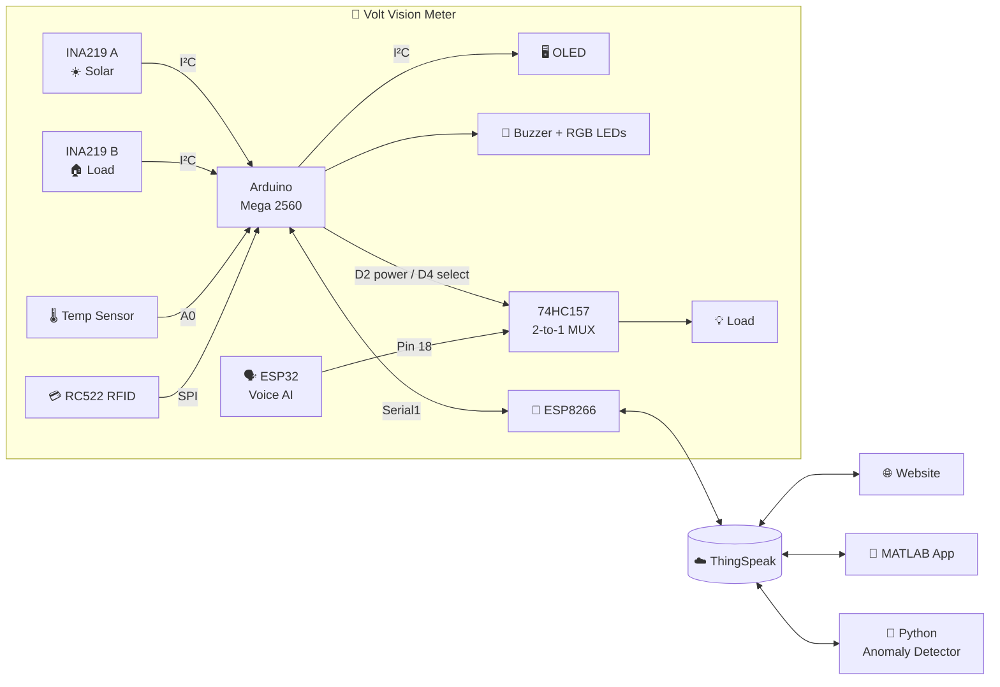
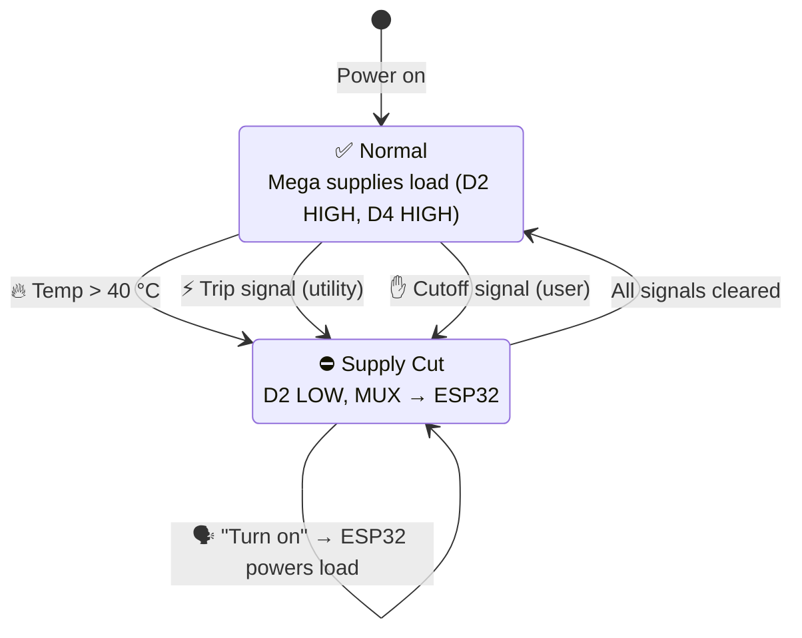
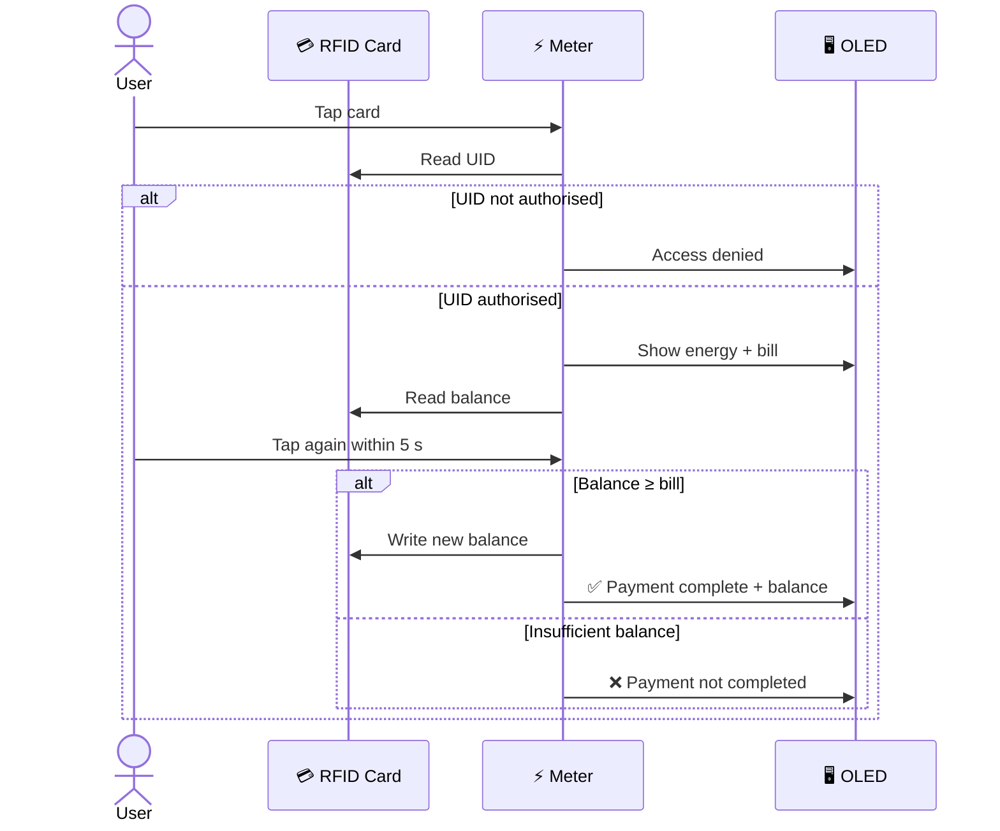

<div align="center">

# ⚡ Smart Electricity Meter

### A smart electricity meter that watches your power, protects your home, and talks back.


[Features](#-features) •
[How It Works](#-how-it-works) •
[Hardware](#-hardware) •
[Getting Started](#-getting-started) •
[Results](#-testing--results) •
[Team](#-team)

</div>

---

## 💡 Why Volt Vision?

You're at the airport and can't remember if you left the heater on. A fire breaks out and firefighters walk into a building that's still live. Your electricity bill arrives and you have no idea which month or which appliance caused it.

A traditional meter can't help with any of that. **Volt Vision** can:

- 📱 **Switch your power off from anywhere**, through the cloud
- 🔥 **Cut the supply automatically** when it detects dangerous heat
- 📊 **Show exactly where your energy goes**, live and historically
- 🔐 **Keep your data private** behind an RFID card and a login
- 🗣️ **Take voice commands** and give energy-saving advice
- 🤖 **Spot unusual consumption** with machine learning before it becomes a problem

> Built by a four-person team for **EE3070 Design Project** at **City University of Hong Kong** (2025).

---

## ✨ Features

<table>
<tr>
<td width="50%" valign="top">

### 📈 Real-Time Monitoring
Two INA219 sensors measure voltage, current and power for the household load and the solar panel. Energy and cost are calculated on-device and shown on an OLED screen.

</td>
<td width="50%" valign="top">

### ☁️ Cloud Connected
An ESP8266 streams every reading to ThingSpeak, building a complete history that the website and app can read from anywhere.

</td>
</tr>
<tr>
<td valign="top">

### 🔌 Remote Power Control
Users can send a **cutoff** signal, and the utility can send a **trip** signal for unpaid bills. The meter checks the cloud and disconnects the load within one cycle.

</td>
<td valign="top">

### 🔥 Fire Protection
Above **40 °C** the meter cuts the supply, sounds the buzzer, turns the status LED red, and publishes a fire alarm to the cloud.

</td>
</tr>
<tr>
<td valign="top">

### 🔐 RFID Access & Payment
Tap an authorised card to reveal your private energy and bill figures. Tap again within 5 seconds to pay directly from the card balance.

</td>
<td valign="top">

### 🗣️ Voice Assistant
An ESP32 running an LLM-powered assistant restores power on command ("turn on") and chats about saving energy, with short-term conversation memory.

</td>
</tr>
<tr>
<td valign="top">

### 🤖 Anomaly Detection
An **Isolation Forest** model scans ThingSpeak data every minute and raises a flag that the meter shows as an OLED warning with an audible alert.

</td>
<td valign="top">

### 🌐 Web Dashboard
Secure login, live gauges that scale to your own limits, alert banners, and interactive charts by day, month or year.

</td>
</tr>
</table>

---

## 🧠 How It Works

### System Architecture



### Power Supply Logic

The meter tracks four control signals, and only one can be active at a time. Any fault hands the load over to the ESP32, so power can only come back through a deliberate voice command.



### RFID Security & Payment



### Main Loop

Every cycle the Mega checks temperature, reads remote signals, applies the power logic, then either refreshes the OLED and handles RFID (between uploads) or pushes data to the cloud (every 15 s).

<details>
<summary>📋 View the full firmware flowchart</summary>


</details>

---

## 🛠️ Hardware


### Bill of Materials

| Component | Qty | Role |
|:--|:--:|:--|
| Arduino Mega 2560 | 1 | Main controller |
| INA219 power sensor | 2 | Solar and load measurement |
| ESP8266 Wi-Fi module | 1 | Cloud connectivity |
| ESP32 with speaker | 1 | Voice assistant and backup supply |
| MFRC522 RFID reader + MIFARE Classic 1K cards | 1 | Access control and payment |
| SSD1306 OLED (0.96") | 1 | Local display |
| Analog temperature sensor | 1 | Fire detection |
| 74HC157 2-to-1 multiplexer | 1 | Supply source selection |
| RGB LED | 2 | Device status and auth status |
| Active buzzer | 1 | Audible alarm |
| Solar cell + battery charge module | 1 | Renewable generation |
| LED load matrix + potentiometer | 1 | Adjustable household load |
| 220 Ω resistor | 2 | Current limiting |

<details>
<summary>📌 Pin mapping (Arduino Mega 2560)</summary>

| Pin | Connects to | Purpose |
|:--|:--|:--|
| `D2` | 74HC157 input B | Mega supply to load |
| `D3` | Buzzer | Alarm |
| `D4` | 74HC157 select | `HIGH` = Mega, `LOW` = ESP32 |
| `D5` `D6` `D7` | Status LED R G B | Green normal, yellow off, red danger |
| `D9` `D10` `D11` | Auth LED R G B | Green when card accepted |
| `A0` | Temperature sensor | Fire detection |
| `D18` TX1 | ESP8266 RX | Wi-Fi serial |
| `D19` RX1 | ESP8266 TX | Wi-Fi serial |
| `D20` SDA / `D21` SCL | OLED, INA219 A, INA219 B | I²C bus |
| `D50` `D51` `D52` `D53` | RC522 MISO MOSI SCK SS | SPI bus |

**ESP32:** `Pin 18` → 74HC157 input A

</details>

<details>
<summary>🔗 I²C bus addresses</summary>

| Device | Address |
|:--|:--:|
| INA219 A (solar) | `0x41` |
| INA219 B (load) | `0x45` |
| SSD1306 OLED | `0x3C` |

</details>

---

## ☁️ Cloud Data Model

| Channel | Field 1 | Field 2 | Field 3 | Field 4 |
|:--|:--|:--|:--|:--|
| **1 · Home Load** | Voltage | Power | Energy | Cost |
| **2 · Status** | Working | Trip | Fire Alarm | Cutoff |
| **3 · Solar** | Voltage | Power | Energy | Discount |

The website adds a **central database** channel (credentials, API keys, channel IDs) and a **user preferences** channel (bill limit, economical threshold, danger cutoff, solar rated power).

---

## 🌐 Web Dashboard

Built in plain HTML, CSS and JavaScript with no frameworks, using the ThingSpeak REST API for reads, writes, bulk writes and clears.

| Page | What it does |
|:--|:--|
| **Login** | Verifies credentials against the central database and stores the user's keys in cookies |
| **Home** | Monthly totals plus live gauges that poll every 5 s and scale to the user's preferences |
| **Settings** | Edit bill limit, thresholds and password, with a reset option |
| **History** | Chart.js charts grouped by hour, day or month |
| **Logout** | Clears cookies and redirects to login |

Gauge angle is scaled to the user's own limit, so a full needle always means "you've hit your target":

$$
\theta = \min\left(\frac{\text{value}}{\text{preference}} \times 120,\ 180\right)
$$

<p align="center">
  
  
</p>

---

## 🤖 Anomaly Detection

An unsupervised **Isolation Forest** separates unusual readings from normal behaviour without any labelled data.

```
ThingSpeak ──(every 60 s)──▶ Python script ──▶ Isolation Forest
     ▲                                              │
     └────────── anomaly flag = 1 / 0 ◀─────────────┘
                        │
                        ▼
          Meter reads flag → "Anomaly Detected!" on OLED + buzzer
```

It caught excessive fan power, bills recorded with zero consumption, and solar generation without earnings, performing well even on about 40 samples. The same analysis is available in MATLAB for offline exploration.


---

## 🚀 Getting Started

### Prerequisites

- Arduino IDE 2.x
- A free [ThingSpeak](https://thingspeak.com/) account with three channels set up as shown above
- Python 3.9+
- MATLAB with App Designer (for the control app)
- A **2.4 GHz WPA2** Wi-Fi network (the ESP8266 can't use 5 GHz or WPA3)

### 1️⃣ Clone the repository

```bash
git clone https://github.com/<your-username>/volt-vision.git
cd volt-vision
```

### 2️⃣ Flash the meter

Install these libraries from the Arduino Library Manager:

`WiFiEsp` · `ThingSpeak` · `DFRobot_INA219` · `Adafruit SSD1306` · `Adafruit GFX` · `MFRC522`

```bash
cp firmware/mega2560/secrets.example.h firmware/mega2560/secrets.h
```

Add your Wi-Fi credentials, channel IDs and API keys to `secrets.h`, open `volt_vision.ino`, select **Arduino Mega 2560**, and upload.

### 3️⃣ Set up the voice assistant

Flash the ESP32 using the [xiaozhi-esp32](https://github.com/78/xiaozhi-esp32) project, then follow [`voice-assistant/README.md`](voice-assistant/README.md) to link the "turn on" command to `Pin 18`.

### 4️⃣ Start anomaly detection

```bash
cd anomaly-detection
pip install -r requirements.txt
python realtime_flag.py
```

### 5️⃣ Launch the website

```bash
cd website
cp config.example.js config.js   # add your central database keys
python -m http.server 5500
```

Open **http://localhost:5500**. It needs to be served over HTTP because login uses cookies.

### 6️⃣ Open the control app

Open `matlab-app/VoltVisionControl.mlapp` in MATLAB, enter your status channel details, and press **Run**.

---

## 📁 Project Structure

```
volt-vision/
├── 📂 firmware/mega2560/     Main meter sketch
├── 📂 voice-assistant/       ESP32 setup and changes
├── 📂 anomaly-detection/     Python real-time detector + MATLAB analysis
├── 📂 matlab-app/            Status monitor and remote cutoff app
├── 📂 website/               HTML / CSS / JS dashboard
├── 📂 hardware/              Schematic and wiring
└── 📂 docs/                  Diagrams and screenshots
```

---

## 🧪 Testing & Results

| Test | Method | Result |
|:--|:--|:--:|
| Wi-Fi and ThingSpeak read/write | Monitored channel updates over time | ✅ |
| Remote cutoff | Sent cutoff from MATLAB App | ✅ Load disconnected, LED yellow |
| Fire alarm | Heated sensor above 40 °C | ✅ Power cut, buzzer, LED red, cloud alert |
| Short-circuit fault | Removed resistor and LED load | ✅ Buzzer and red LED triggered |
| Voice power restore | Said "turn on" after cutoff | ✅ ESP32 powered load via MUX |
| RFID verification | Tested authorised and unknown UIDs | ✅ Only authorised card shown data |
| RFID payment | Paid with sufficient and low balances | ✅ Correct deduction and messages |
| Website calculations | Compared exported CSV against Excel | ✅ Totals matched |
| Login / logout | Checked cookie creation and clearing | ✅ |
| Anomaly detection | Ran Isolation Forest on logged data | ✅ Anomalies flagged |

---

## ⚠️ Limitations

> **This is a low-voltage educational prototype. Never connect it to 220 V mains.**

- **Update speed:** ThingSpeak's free tier allows one write every 15 s, and bulk writes may be queued (HTTP 202).
- **Mains measurement:** the INA219 and the logic circuit run at 5 V / 3.3 V only.
- **Card security:** MIFARE Classic 1K is unencrypted and stores the balance on the card with no transaction log.
- **Web security:** keys live in browser cookies and credentials in a ThingSpeak channel, which is suitable for a demo only.
- **Solar readings:** the battery module reads 0 W once fully charged.

---

## 🗺️ Roadmap

- [ ] Faster updates with a paid ThingSpeak plan or self-hosted MQTT broker
- [ ] 3D-printed enclosure
- [ ] AES-encrypted cards (DESFire EV3 / NTAG 424 DNA) with cloud transaction logs
- [ ] Ensemble anomaly detection (Isolation Forest + LOF + Autoencoder) with time and weather features
- [ ] Rebuild the website with React, Tailwind, Node.js and Firebase Auth
- [ ] Voice assistant that reads cloud data to forecast bills
- [ ] SMS alerts for users without smartphones
- [ ] Isolated mains-rated measurement front end

---

## 👥 Team

<table>
<tr>
<td align="center" width="25%">
<b>Wootinun Ouppapong</b><br/>
<sub>(Boon)</sub><br/><br/>
🌐 Web Dashboard<br/>
<sub>Architecture, database design, login, settings, history, testing</sub>
</td>
<td align="center" width="25%">
<b>Sarker Aumio Kumar</b><br/><br/><br/>
📈 Monitoring & ML<br/>
<sub>Firmware setup, INA219 monitoring, fault detection, OLED display, anomaly detection</sub>
</td>
<td align="center" width="25%">
<b>Wong Xin Jerry</b><br/><br/><br/>
💳 RFID Systems<br/>
<sub>Energy and bill calculation, identity verification, payment, top-up</sub>
</td>
<td align="center" width="25%">
<b>Ng Pui Chak Johnny</b><br/><br/><br/>
☁️ IoT & Voice<br/>
<sub>Wi-Fi and cloud, solar measurement, fire alarm, ESP32 voice, MATLAB App</sub>
</td>
</tr>
</table>

---

## 🙏 Acknowledgements

- [DFRobot_INA219](https://github.com/DFRobot/DFRobot_INA219) for the power sensor library
- [thingspeak-arduino](https://github.com/mathworks/thingspeak-arduino) for cloud communication
- [xiaozhi-esp32](https://github.com/78/xiaozhi-esp32) for the ESP32 voice assistant
- [Chart.js](https://www.chartjs.org/) for history charts
- Department of Electrical Engineering, City University of Hong Kong

---

## 📄 License

Released under the [MIT License](LICENSE).

<div align="center">

**⚡ Volt Vision · Know your power.**

</div>
